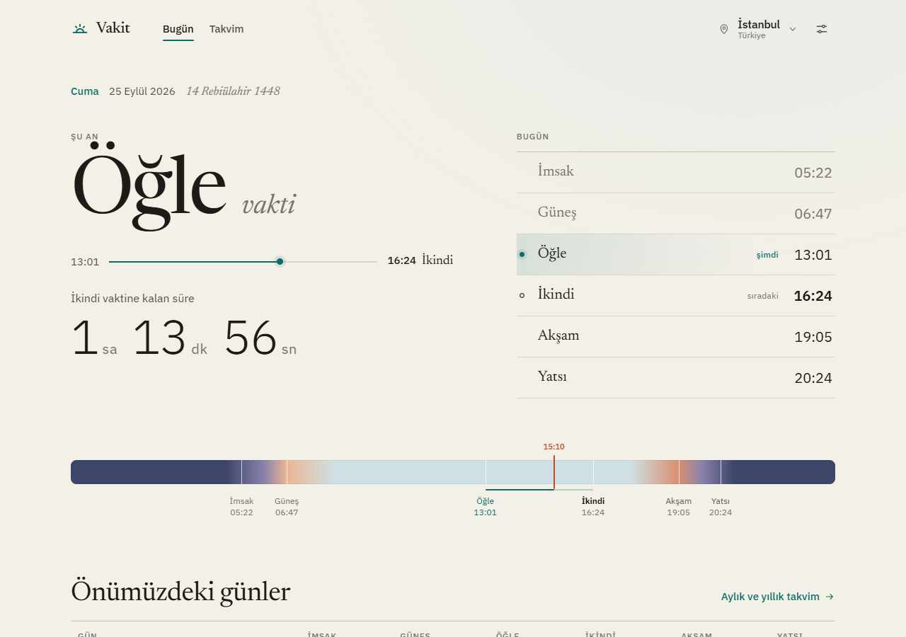
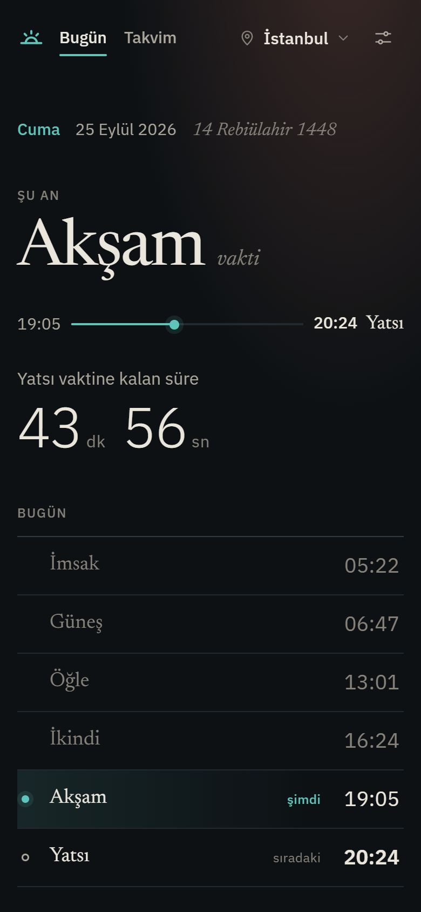
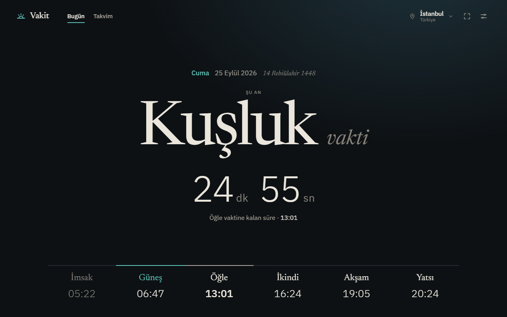
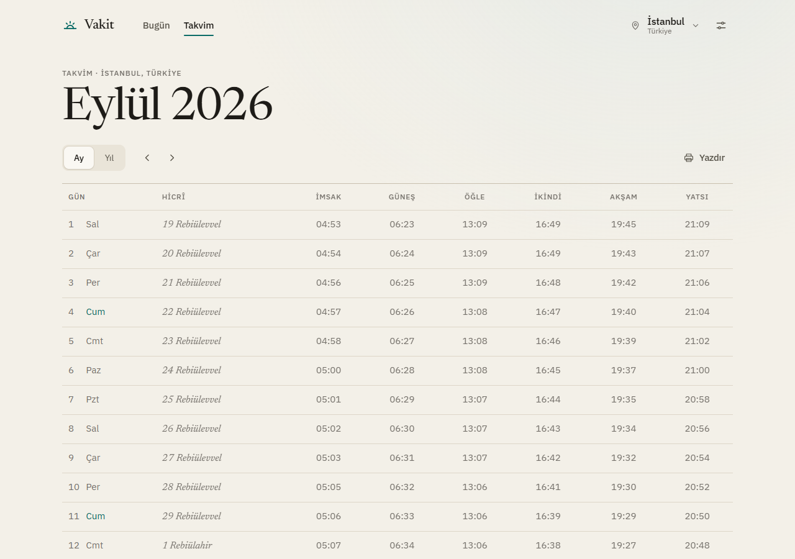

<div align="center">

[Türkçe](README.md) · **English**

<br>


# Vakit

Prayer times from the Presidency of Religious Affairs of Türkiye (Diyanet):<br>
the prayer period you are in, a live countdown and a year-round calendar.

<sub>The times are not fetched from Diyanet directly but through
<a href="https://ezanvakti.imsakiyem.com">ezanvakti.imsakiyem.com</a>, an API that republishes Diyanet's data.</sub>

### [Open the app →](https://fignupafya.github.io/vakit/)



</div>

## What it does

- **Where you are in the day.** The top of the screen shows the prayer period you are in (for example *Öğle*),
  when it started, when it ends and what comes next, with a live countdown. One glance answers
  "which prayer time is it, until when, and how long is left".
- **Finds you.** On first launch it asks for your location and picks the nearest official Diyanet
  prayer-time point. Districts without their own entry use the province centre, and the app tells you so.
  The location you chose never changes by itself; when you are in another province, the app offers to
  switch.
- **Calendar.** Any month or a whole year, with Hijri dates and Fridays marked. Print a year and every
  month lands on its own page.
- **Installable (PWA).** Add it to your home screen: it opens like an app, and it opens offline too.
- **Works offline within your province.** While online, this month's and next month's times for every district
  of the selected province are downloaded in the background, so without internet you can still switch between
  its districts. Switching to another province needs internet.
- **Themes.** System, light, dark, or *follow the sun*: light after sunrise, dark once the evening prayer begins.
- **Ramadan-aware.** Iftar and sahur labels, a countdown to iftar, and the day of Ramadan.
- **Nothing to install on a server.** Plain HTML, CSS and JavaScript modules: no build step, no packages, no tracking.

The interface is in Turkish.

<p align="center">
  
  &nbsp;&nbsp;
  
</p>

<p align="center">
  
</p>

## Install it on your phone

| Device | How |
|---|---|
| Android (Chrome, Edge, Samsung Internet) | Open the link, then choose **Install app** from the prompt or the ⋮ menu. The app also offers it under *Ayarlar → Uygulama*. |
| iPhone / iPad (Safari) | Tap **Share**, then **Add to Home Screen**. |
| Desktop (Chrome, Edge) | Click the install icon in the address bar. |

## How it works

```
prayer-time API (adapter) → service + cache → state → view model → page
browser location → place names → the provider's list of locations
```

- It is a static site: the `app/` folder is the whole app. GitHub Pages serves it; there is no backend.
- Prayer times come from [ezanvakti.imsakiyem.com](https://ezanvakti.imsakiyem.com), a community API that
  republishes Diyanet's data. The app talks to it through an **adapter**, so switching to another source
  (for example Diyanet's official Awqat Salah API) means writing one adapter and changing one line in `config.js`.
- Downloaded months are kept in the browser for 30 days, so normal use makes only a few requests a day.
  The other districts of the selected province are fetched in the background, 4 seconds apart (the source
  allows 100 requests per 5 minutes); fresh months are skipped, and the download stops if you switch province.
  A service worker stores the app's files on the first visit, so the app opens offline.
- **Location and privacy:** coordinates are rounded to about 100 m and sent to
  [BigDataCloud](https://www.bigdatacloud.com)'s free reverse-geocoding service, only to learn the province
  and district names. The names are then matched against Diyanet's list. Nothing else leaves the device.

## Run it locally

```bash
node serve.mjs
```

Then open <http://127.0.0.1:5317>. On Windows you can double-click `Baslat.bat` instead.
Node.js is only needed for this tiny static server; it has no packages. Any static file server pointed
at `app/` works too. Opening `index.html` straight from disk doesn't work, because browsers don't run
ES modules from `file://`.

## Project structure

```
app/                     the whole web app (published to GitHub Pages)
  index.html
  manifest.webmanifest   PWA: name, icons, shortcuts
  sw.js                  service worker: offline copy of the app
  styles/                tokens.css (colours, type) · base · components · layouts · print
  src/
    app.js               composition root: the only place where layers meet
    config.js            data source, location service, defaults
    router.js            #/ (Today) · #/takvim · #/takvim/2026-09 · #/takvim/2026
    core/                logic that knows neither the UI nor any API
      schedule.js          which period is it, what's next, how long is left (pure function)
      prayer-service.js    wraps the data source with a cache (months and whole years)
    providers/           adapters for prayer-time APIs
      contract.js          the provider contract and the data model
      imsakiyem.js         ezanvakti.imsakiyem.com (in use)
      ezanvakti.js         ezanvakti.emushaf.net (alternative)
    location/            browser location → place names → provider location
    state/               user settings (kept in the browser)
    ui/                  view model, shell, pages (Today: Ferah and Odak layouts; Calendar), components
tools/                   icon and screenshot generators
serve.mjs                local static server (Node.js built-ins only)
```

## Extending it

**Use a different data source.** Write a factory in `app/src/providers/` that returns the object described
in `contract.js` (`listCountries`, `listRegions`, `listDistricts`, `getTimes`, optional `searchDistricts`)
and maps the API's responses to that model. Register it in `providers/index.js` and set `provider` in
`config.js`. If it uses Diyanet's location IDs, set `idScheme: 'diyanet'` so saved locations stay valid.
The official Awqat Salah API requires a username and password, which can't live in browser code, so it
has to be added through a small server of your own.

**Add a layout for the Today screen.** Add `{ id, label, hint, create(actions) }` in `app/src/ui/pages/`
and list it in `TODAY_LAYOUTS` in `pages/index.js`; it shows up in Settings automatically. `create`
returns `{ el, update(vm) }`, and `update` is called every second with the view model.

**Icons and screenshots.** `node tools/make-icons.mjs` regenerates the app icons.
`node tools/screenshots.mjs` retakes the screenshots in this README (with the local server running).

## Handy URL parameters

| Parameter | Effect |
|---|---|
| `?now=2026-09-25T21:30` | Freeze the clock (location time): after the night prayer |
| `?now=2026-03-10T17:45` | Ramadan: countdown to iftar |
| `?geo=40.9903,29.0289` | Pretend to be in Kadıköy, which maps to İstanbul (centre) |
| `?geo=deny` | Behave as if location permission was denied |
| `?theme=dark` | Force a theme for this visit |

## Deployment

Every push to `main` publishes the `app/` folder to GitHub Pages
(see [`.github/workflows/pages.yml`](.github/workflows/pages.yml)).

## Disclaimer

Prayer times are published by the Presidency of Religious Affairs of Türkiye (T.C. Diyanet İşleri Başkanlığı).
This app does not fetch them from Diyanet directly but through the [ezanvakti.imsakiyem.com](https://ezanvakti.imsakiyem.com) API.
This is an independent project; it is not affiliated with or endorsed by Diyanet or ezanvakti.imsakiyem.com.
